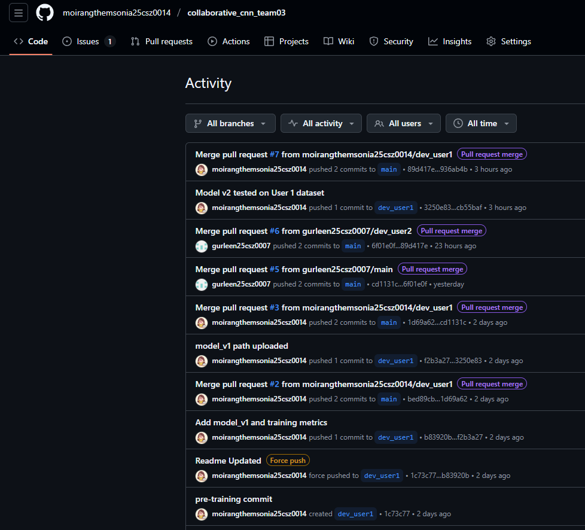
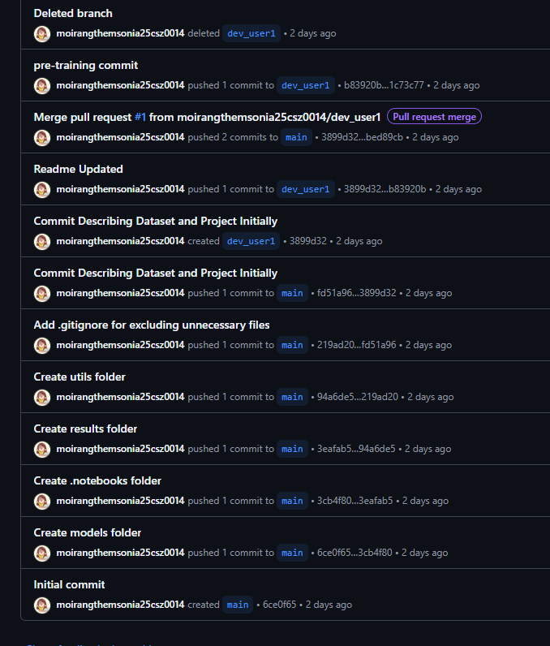
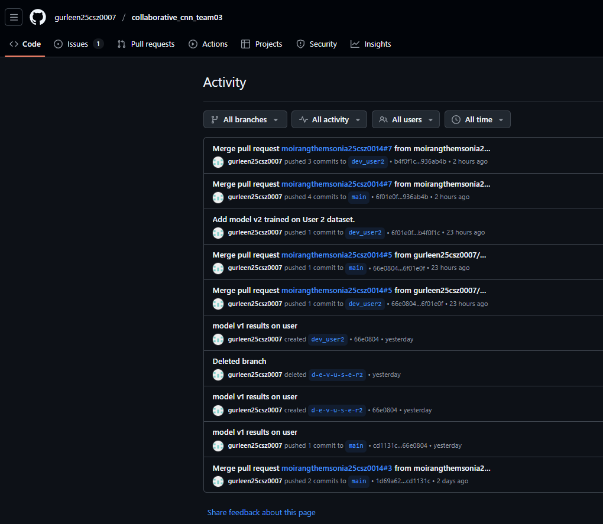

# Collaborative CNN Project — Team 03

**User 1:** _Moirangthem Sonia_  
**User 2:** _Gurleen Kaur_

## 1. Introduction

In this assignment we worked in teams of two to collaboratively design, train, and evaluate convolutional neural network (CNN) models for an image classification task using different datasets. The project emphasizes:

- Deep learning implementation with **PyTorch**
- Full GitHub collaboration workflow (repository creation, forks, branches, PRs, and issues)
- Cross-domain testing and model comparison (no raw data sharing only models and metrics)

---

## 2. Base models used

We used **ResNet-18** as the common base for experiments because it offers a good balance between speed, simplicity and competitive accuracy for prototyping.

### 2.1 User 1 — Model v1

**Model name:** ResNet-18 (custom head)

**Architecture details**

- Backbone: ResNet-18 (TorchVision)
- Classifier head: `Linear → BatchNorm → ReLU → Dropout → Linear` (replaces original single FC)
- Optional utilities to freeze/unfreeze backbone for classifier-only fine-tuning

**Hyperparameters**
| Parameter | Value |
|---|---:|
| Batch size | 32 |
| Epochs | 50 |
| Optimizer | Adam (lr = 1e-4) |
| Loss | CrossEntropyLoss |
| LR scheduler | StepLR(step_size=5, gamma=0.1) |
| Image size | 224 × 224 |
| Augmentations | RandomHorizontalFlip, RandomRotation(15°), ColorJitter(brightness=0.2, contrast=0.2, saturation=0.2) |
| Normalization | mean = [0.485,0.456,0.406], std = [0.229,0.224,0.225] |
| Pretrained | False |
| Classifier hidden dim | 512 |
| Dropout (head) | 0.5 |
| Num workers | 2 |

---

### 2.2 User 2 — Model v2 (improved)

**Model name:** ResNet-18 + attention (SE-style / light attention) and classifier tweaks

**Motivation & notes**

- Started from user1 modelv1 and experimented with light attention module added to the classifier head to help robustness across datasets.
- Considered architectural improvements (pre-activation, SiLU/GeLU, SE blocks, modern stem) as notes for future work.
- For transfer learning, backbone may be frozen and only the new head trained; fine-tuning performed as needed.

**Hyperparameters**
| Parameter | Value |
|---|---:|
| Epochs | 40 |
| Batch size | 32 |
| Optimizer | Adam (lr = 1e-3) |
| Loss | CrossEntropyLoss |
| Augmentation | Resize → Crop(224) → RandomFlip → RandomRotate(±10°) → Normalize |
| Device | GPU (T4) |
| Classes (User 2) | 15 (used for selected runs) |
| Hidden dim | 512 |
| Dropout | 0.5 |
| Attention ratio | 16 |

---

## 3. Datasets

### 3.1 User 1 dataset — _Plant Disease_ (Kaggle)

- **Source:** https://www.kaggle.com/datasets/emmarex/plantdisease
- **Total images:** 20,639
- **Split (User 1):** 70% train / 15% val / 15% test
  - Train: 14,441
  - Val: 3,109
  - Test: 3,089
- **Notes:** Original dataset lacked explicit splits; User 1 created the 70:15:15 split. Images are leaf photographs; many classes have moderate support.

---

### 3.2 User 2 dataset — _New Plant Diseases_ (Kaggle)

- **Source:** https://www.kaggle.com/datasets/vipoooool/new-plant-diseases-dataset
- **Structure:** Dataset already provided with train/val/test folders (User 2 used the provided splits).
  - Train samples: 70,295 (JPEG)
  - Val samples: 17,572 (JPEG)
  - Test samples: 33 (JPEG) — User 2 restructured test file names originally (test folder contained class labels as filenames); after restructuring the test subset covered 8 classes only.
- **Classes:**
  - Train/Val: 38 classes
  - Test (original small set used for cross-test): 8 classes
- **Notes:** Dataset has a much larger and more varied distribution (lighting, backgrounds, camera viewpoints) compared with User 1’s dataset.

---

## 4. Evaluation metrics

We used standard classification metrics to evaluate model performance and to analyze generalization across datasets:

- **Accuracy** — overall correct predictions / total samples
- **Precision, Recall, F1-score** — per-class and averaged (micro / macro / weighted)
- **Confusion matrix** — to inspect class-level confusions
- **Support** — number of true samples per class

These metrics were computed using `sklearn.metrics.classification_report` and a confusion matrix utility. Accuracy and F1 are the primary performance indicators for cross-dataset comparisons.

---

## 5. Results

> All numbers below are taken from the final runs and cross-test experiments. Tables are simplified for readability; per-class details are included where informative.

### 5.1 User 1: Model v1 evaluated on User 1 dataset (train/val/test)

**Training / Validation highlights**

- Final training accuracy: **95.98%**
- Final training loss: **0.12984**
- Best validation accuracy: **97.73%** (epoch 37)
- Best validation precision / recall / F1 ≈ **0.977** (epoch 37)
- Lowest validation loss: **0.07026** (epoch 49)

**Test (User 1 test set, N = 3,109)**

- **Overall test accuracy:** **97.59%**

**Sample per-class excerpt (test set)**

| Class                         | Precision | Recall |    F1 | Support |
| ----------------------------- | --------: | -----: | ----: | ------: |
| Pepper_bell\_\_Bacterial_spot |     0.968 |  0.987 | 0.977 |     151 |
| Pepper_bell\_\_healthy        |     0.996 |  0.996 | 0.996 |     223 |
| Potato\_\_Early_blight        |     0.974 |  0.993 | 0.983 |     150 |
| Tomato_Bacterial_spot         |     0.975 |  0.991 | 0.983 |     320 |
| Tomato_healthy                |     1.000 |  0.992 | 0.996 |     240 |

(Full per-class table included in `results/` JSON.)

---

### 5.2 User 2: Model v2 evaluated on User 2 dataset

**Training / Validation highlights**

- Train — loss: **0.0707**, acc: **0.9785**, P/R/F1 ≈ **0.9785**
- Val — loss: **0.0201**, acc: **0.9941**, P/R/F1 ≈ **0.9941**

**Test (User 2 test set, small set N = 33)**

- **Overall test accuracy:** **75.76%**

**Classification report (test subset, N=33)** — excerpt

| Class                       | Precision | Recall |   F1 | Support |
| --------------------------- | --------: | -----: | ---: | ------: |
| Apple\_\_\_Apple_scab       |      1.00 |   0.33 | 0.50 |       3 |
| Apple\_\_\_Cedar_apple_rust |      1.00 |   1.00 | 1.00 |       4 |
| Potato\_\_\_Early_blight    |      1.00 |   0.80 | 0.89 |       5 |
| Tomato\_\_\_Early_blight    |      0.86 |   1.00 | 0.92 |       6 |

**Averaged metrics:** micro avg = (precision=0.96, recall=0.76, f1=0.85), macro avg = (precision=0.86, recall=0.66, f1=0.72), weighted avg ≈ (precision=0.91, recall=0.76, f1=0.80).

> Note: The test set here is very small (N=33) and restricted to 8 classes — interpret aggregated numbers with caution.

---

### 5.3 Cross-testing: User 2 tests User 1 model (Model v1 on User 2 test set)

User 2 first ran User 1’s `model_v1.pth` on their own test set (class mapping mismatch). Result was poor due to severe class mismatch / distribution differences:

- **Overall accuracy:** **0.1212 (≈ 12.12%)**

| Class Name        | Precision | Recall | F1-Score | Support |
| ----------------- | --------: | -----: | -------: | ------: |
| AppleCedarRust    |    0.0000 | 0.0000 |   0.0000 |       4 |
| AppleScab         |    0.1364 | 1.0000 |   0.2400 |       3 |
| CornCommonRust    |    0.0000 | 0.0000 |   0.0000 |       3 |
| PotatoEarlyBlight |    0.0000 | 0.0000 |   0.0000 |       5 |

**Classification report (summary)** — poor precision/recall for many classes, macro-avg F1 ≈ **0.1133**, weighted avg F1 ≈ **0.0622**.  
Primary cause: User 1’s model was trained on a different set of classes (15) vs. the 8-class subset used in this cross-test and the class labeling/ordering did not align.

Summary (Cross-test User2 → User1 Model v1)\*\*

| Metric           |      Value |
| ---------------- | ---------: |
| Overall Accuracy | **0.1212** |
| Macro Precision  |     0.1420 |
| Macro Recall     |     0.1875 |
| Macro F1-score   |     0.1133 |

### 5.4 Cross-testing: User 1 evaluates User 2's Model v2 on Dataset 1 (after class-alignment fine-tuning)

To handle the mismatch between User 2’s dataset (38 classes) and User 1’s dataset (15 classes),  
User 2 **retrained only the final classifier layer for 5 epochs** using User 1’s label set.  
The adapted `model_v2` weights were then tested by User 1 on the full test split (N = 3,109).

**Overall Results on User 1 Test Set**

| Metric            |      Value |
| ----------------- | ---------: |
| Accuracy          | **96.17%** |
| Number of samples |      3,109 |

**Sample of Per-Class Performance**

| Class                          | Precision | Recall | F1-Score | Support |
| ------------------------------ | --------: | -----: | -------: | ------: |
| Pepper**bell\_**Bacterial_spot |    0.9733 | 0.9669 |   0.9701 |     151 |
| Pepper**bell\_**healthy        |    0.9737 | 0.9955 |   0.9845 |     223 |
| Tomato_healthy                 |    1.0000 | 0.9917 |   0.9958 |     240 |

**Summary**

- User 2's model, after a light fine-tuning step (only last layer retrained),  
  **generalizes extremely well** to User 1’s domain.
- The final adapted model achieves **96.17% accuracy**, very close to User 1’s original model performance (97.59%).
- This demonstrates the effectiveness of **transfer learning and classifier-level adaptation**, even with differing class counts and domain characteristics.

## 6. Conclusion

This collaborative project successfully demonstrated how two users can jointly develop, evaluate, and refine CNN models without sharing raw data.  
Key achievements include:

- **Model Development:**  
  Both User 1 and User 2 independently trained CNN models (ResNet-18 variants) on different plant disease datasets.

- **Cross-domain Evaluation:**  
  Cross-testing showed that models trained on one dataset performed well in-domain but suffered significant degradation on the other dataset due to **domain shift**, differing class distributions, and image characteristics.

- **Model Adaptation & Transfer Learning:**  
  User 2’s model, after performing a **5-epoch classifier-only fine-tuning** aligned to User 1’s class set, achieved an impressive **96.17% accuracy**, nearly matching User 1’s original model.  
  This highlights the power of **transfer learning** and **lightweight adaptation** for improving cross-domain generalization.

- **Grad-CAM Insights:**  
  Grad CAM visualizations helped verify that models focused on relevant regions (leaf textures, lesion patterns) and revealed failure cases where background noise or lighting affected predictions.

- **GitHub Collaboration Workflow:**  
  The full workflow repository setup, branching, PRs, issues, forks, and result sharing mimics real-world ML team collaboration without sharing datasets.

Overall, the experiment demonstrates both the challenges and practical solutions for robust machine learning across heterogeneous data domains.

---

## Verification of Collaboration — GitHub Activity

### User 1 Activity

User 1 actively contributed to the project by creating the base repository, setting up the initial directory structure, adding the `.gitignore`, committing the first version of the model (Model v1), pushing the `dev_user1` branch, and opening the first Pull Request for model integration. The screenshot below shows User 1's GitHub activity timeline, confirming these contributions.

**User 1 Activity Screenshot:**  

### User 2 Activity

User 2 contributed by forking the repository, testing User 1’s Model v1 on their own dataset, opening the issue with detailed results, creating the `dev_user2` branch, developing Model v2, and submitting the second Pull Request to the base repository. The screenshot below shows User 2's GitHub activity timeline as verification of these contributions.

**User 2 Activity Screenshot:**  

